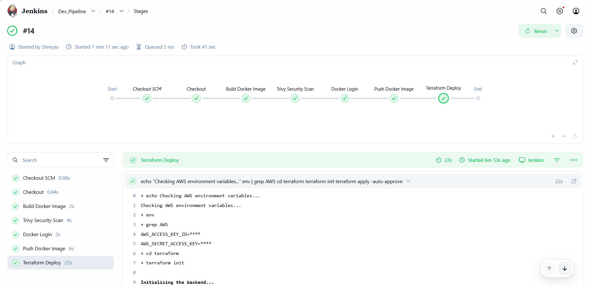
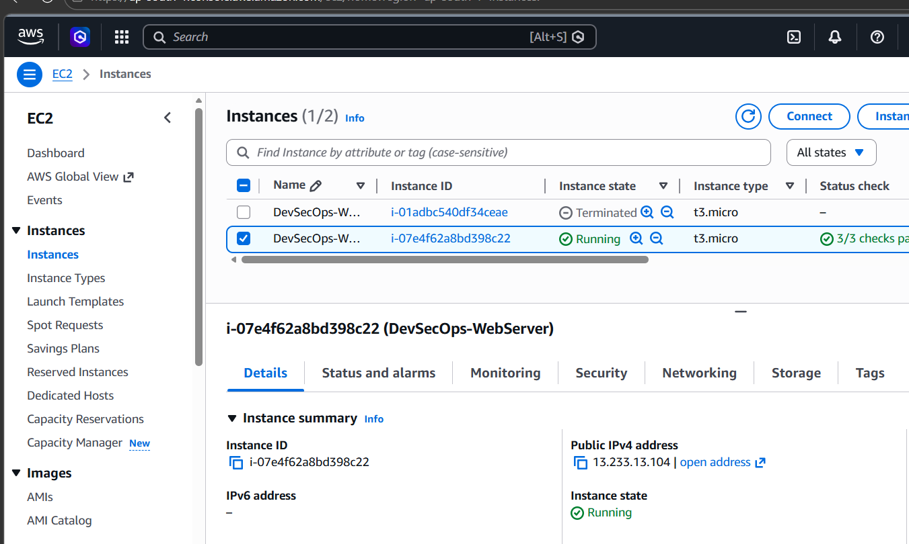

# 🛡️ DevSecOps CI/CD Pipeline with Terraform, Jenkins & Trivy

### Secure Infrastructure Deployment with Automated Security Scanning

This project demonstrates a DevSecOps pipeline that automates infrastructure provisioning, container image creation, vulnerability scanning, and deployment on AWS.

The pipeline integrates Terraform for Infrastructure as Code, Docker for containerization, and Trivy for security scanning within a Jenkins CI/CD pipeline. The goal is to detect security vulnerabilities early and ensure secure cloud infrastructure deployment.

---

## 🔍 Security Scanning & Remediation

The project uses Trivy to scan both Infrastructure as Code (Terraform) and Docker container images to identify security vulnerabilities before deployment.

### Key Security Improvements Implemented

#### 🔐 Restricted SSH Access

**Issue:**  
Security group allowed SSH access from anywhere (`0.0.0.0/0`), increasing the risk of brute-force attacks.

**Solution:**  
SSH access restricted to trusted IP ranges to minimize unauthorized access.

---

#### 📄 Enforced IMDSv2

**Issue:**  
Using IMDSv1 exposes EC2 instances to potential IAM credential theft via SSRF attacks.

**Solution:**  
IMDSv2 enabled to enforce secure metadata access using session tokens.

---

#### 💾 Encrypted EBS Volumes

**Issue:**  
Unencrypted EBS volumes expose sensitive data at rest.

**Solution:**  
Enabled AES-256 encryption for EBS root volumes.

---

#### 🔒 Secure Container Images

**Issue:**  
Docker images may contain vulnerable packages.

**Solution:**  
Trivy scans container images during the Jenkins pipeline to detect vulnerabilities before deployment.

---

## 🛠️ Tools & Technologies

| Category               | Tools                           |
| ---------------------- | ------------------------------- |
| Cloud Platform         | AWS (EC2, VPC, Security Groups) |
| Infrastructure as Code | Terraform                       |
| Containerization       | Docker                          |
| CI/CD Automation       | Jenkins                         |
| Security Scanning      | Trivy                           |
| Version Control        | Git & GitHub                    |
| Operating System       | Linux / Ubuntu                  |
| AI Assistance          | Generative AI                   |

---

## 🤖 Generative AI Usage

Generative AI was used to assist in several aspects of this project:

- Troubleshooting Jenkins pipeline errors
- Understanding and fixing Terraform configurations
- Interpreting Trivy vulnerability scan results
- Structuring project documentation
- Improving README clarity and formatting

📄 **Proof of AI Usage:**  
(Add your AI report link here)

---

## 🚀 CI/CD Pipeline Workflow

The Jenkins pipeline automates the complete DevSecOps process:

1. Pull source code from GitHub repository
2. Build Docker image
3. Perform Trivy container security scan
4. Push Docker image to registry
5. Run Terraform plan and apply
6. Deploy infrastructure on AWS EC2
7. Run the application container on the server

---

## 📸 Pipeline Execution Evidence

---

The CI/CD pipeline successfully completed all stages including:

- Code checkout
- Docker image build
- Trivy security scan
- Infrastructure provisioning using Terraform
- Deployment to AWS EC2

Security scanning was integrated into the pipeline using Trivy to detect vulnerabilities in container images before deployment.

### ✅ Successful Pipeline Execution

---

## 🌐 Application Deployment

The application is deployed on an AWS EC2 instance after successful pipeline execution.

** http://13.233.13.104:3000**

---

## 🏗️ Terraform Infrastructure

**provider.tf**  
Defines AWS provider configuration.

**ec2.tf**  
Creates EC2 instance used for application deployment.

**securitygroup.tf**  
Defines secure inbound and outbound rules.

**variables.tf**  
Contains configurable infrastructure variables.

**outputs.tf**  
Displays useful information such as EC2 public IP.

---

## 🐳 Docker Containerization

**Dockerfile**  
Builds the application container image.

**docker-compose.yml**  
Defines the container environment and runtime configuration.

---

## ⚙️ Jenkins Automation

**Jenkinsfile**

Defines the full CI/CD pipeline including:

- Code checkout
- Docker image build
- Trivy vulnerability scan
- Docker image push
- Terraform infrastructure deployment

---

## 📌 Key DevSecOps Concepts Demonstrated

- Infrastructure as Code (Terraform)
- Container Security Scanning
- Secure Cloud Infrastructure
- Automated CI/CD Pipelines
- DevSecOps Security Gates

---

## ✅ Outcome

This project demonstrates how DevSecOps practices can be implemented to ensure secure, automated, and reliable cloud deployments using modern DevOps tools.
